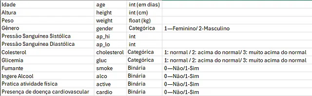

<div style= "text-align: justify">

# Modelo Preditivo para Análise de Risco de Doenças Cardio-Vasculares


# Resumo
Utlizando de uma base de dados pública disponível do Kaggle fizemos uma análise exploratória de dados (link abaixo) e um modelo de predição de risco de desenvolver Doenças Cardio-Vasculares. O dataset possui mais de 70 mil registros de pacientes atendidos com informações sobre idade, gênero, peso e altura e ainda marcadores de saúde como pressão arterial, níveis de glicose e colesterol sanguíneos.
Para o modelo foram testados vários algoritmos de Machine Learning e foi escolhido o que apresentou os melhores resultados com base em métricas como Acurácia, Precisão, Recall e F1-Score. Utilizamos também uma curva de calibração para verificar qual dos modelos tinha um melhor poder de aproximação na predição com os valores reais.
E por fim o modelo e um resumo da análise dos dados foram publicados no Streamlit Cloud para consultas por meio da internet.

[Análise exploratória de dados sobre doenças cardiovasculares(Github)](https://github.com/julianonicoletti/cardio_disease_data_analysis)

[Artigo do Medium sobre a análise](https://github.com/julianonicoletti/cardio_disease_data_analysis)

[Deploy no Streamlit com o modelo e análise dos dados](https://cardiodiseaseprediction.streamlit.app/)


# 1. O Problema
>As doenças cardiovasculares (**DCVs**) representam um conjunto de enfermidades que afetam o coração e os vasos sanguíneos, sendo a principal causa de morte no mundo — **OPAS (Organização Pan-Americana da Saúde)**

Doenças cardiovasculares são um grupo de doenças do coração e dos vasos sanguíneos, onde são exemplos o infarto, arritmia, Acidente Vascular Cerebral, Insuficiência cardíaca entre outros.

Estima-se que apenas no Brasil elas sejam responsável por mais de 300 mil mortes ao ano. A nível mundial esse número chega a 17,9 milhões, representando 32% do total de mortes.

Fazer uma análise minuciosa de dados de pesquisas sobre o assunto torna-se muito relevante para o entendimento e aprofundamento, podendo ajudar para diminuir esses índices de mortes.

# 2. O Dataset
Os dados analisados foram retirados do site [Kaggle](https://www.kaggle.com/datasets/sulianova/cardiovascular-disease-dataset) e apresentavam as colunas e linhas como o exemplo abaixo:




As colunas foram coletadas de exames realizados em pacientes e a coluna ‘cardio’ (Presença de doença cardiovascular) é o target do dataset.

# 3. Trabalho com as variáveis

Pela análise do dataset verificou-se que a coluna 'age' está em dias. Fizemos uma transformação para anos e arredondamos sempre para baixo:

```python
#criando nova coluna temporária com o resultado da divisão por 365
df['years'] = np.floor(df['age']/365).astype('int')
#atribuindo os valores da nova coluna na coluna antiga 'age'
df['age'] = df['years']
#apagando a coluna temporária 'years'
df = df.drop('years', axis=1)
```

Consultando a literatura verificamos que um dos melhores marcadores para problemas cardiovasculares é o Índice de Massa Corporal (IMC, ou inglês BMI). Assim criamos uma coluna usando os valores peso e altura de cada linha:
```python
#criando a coluna de IMC = BMI = Body Max Index (Indice de Massa corporal)
df['bmi'] = df['weight']/(df['height']/100)**2
```


       Dataset depois das alterações da coluna 'age' e criação da coluna 'bmi'

## 3.1 Os outliers
Verificou-se a presença de outliers bastante discrepantes do 'senso comum' como altura de 55cm e peso de 10kg (todos os pacientes são adultos) e outros que são impossíveis de acontecer, como pressão arterial negativa.


Utilizando um valor de corte de maiores de 97,5% do percenti e 2,5% abaixo verificamos que seriam menos de 6% do total do dataset, por isso resolvemos retirar esses valores.


## 3.2 Rescaling
A técnica de rescaling é uma etapa importante de preparo para um dataset que, posteriormente, será usado para construir um modelo de machine learning. 
Essa técnica consiste em tranformar todas as variáveis em valores números que tenham a mesma escala, fazendo com que diminua a diferença (em valores) entre cada um. Um modelo de predição feito sobre um dataset com valores muito discrepantes pode dar uma importância maior a variável de maior escala o que não deveria ser o correto.

No nosso caso foi dado preferência para o *RobustScaler* pelo fato dele tratar melhor com outliers. Nos testes ele demonstrou ter melhores parâmetros do que o *MinMaxScaler* e *StandartScaler*.


Exemplo do dataset após o rescaling.

# 4. Seleção das variáveis

Utilizamos um modelo de *ExtraTreesClassifier* para obter uma escala das variáveis mais importantes do dataset.


**No entanto, acabamos utilizando todas as variáveis já que, em testes, o dataset completo apresentava melhores resultados.**

# 5. Escolha do Modelo de Predição
Para a escolha do melhor modelo que se adapte a esse problema fizemos uma seleção dos mais conhecidos quando o assunto é classificação. Foram eles:
- **K-Nearest Neighbors**: Opera com base na idéia de que pontos de dados similares estão próximos uns aos outros, medindo a distância entre eles e encontrando os "Vizinhos mais próximos" ele consegue dizer a que classe pertence um novo ponto.
- **Logistic Regression**: Funciona com base numa função sigmoide (Curva S) que permite prever probabilidades e após escolher um ponto de corte, a função estabelece se o novo valor pertence a "A" ou "B".
- **Random Forest Classification**: Combina múltiplas árvores de decisão, "carregando" a previsão de cada árvore para estabelecer a classificação de um novo valor.
- **Gradient Boosting Classification**: Funciona de forma parecida com a Random Forest, no entanto usa dos erros de uma árvore anterior para criar novas árvores, assim cada árvore adicionada tenta minimizar esses erros a um ponto ideal de predição.

Após testar cada um dos algoritmos citados tivemos os seguintes resultados quanto a Acurácia, Precisão, Recall, e área abaixo da curva ROC


Como segundo parâmetro (não menos importante que os obtidos acima) utizamos uma Curva de Calibração e tivemos as seguintes plotagens:

<table>
  <tr>
    <td></td>
    <td></td>
    
  </tr>
  <tr>
    <td></td>
    <td></td>
    </tr>
</table>

Uma curva de calibração é particularmente útil para modelos de classificação e ela indica quão bem as probabilidade previstas pelo modelo se alinham com as probabilidades reais.
No nosso caso, analisando as plotagens das curvas 2 modelos se destacaram, o *KNN* e o *Gradient Boosting*. Este último é ainda melhor pois as previsões caminham quase junto a linha diagonal que indica uma calibração perfeita.

# 5.1 Fine Tuning do modelo escolhido
Após a escolha do melhor modelo fizemos um método chamado fine tuning que é rodar testes com diferentes *hiper-parâmetros* para encontrar o que melhor se adapte ao problema.
Utilizamos o método *GridSearchCV*, que consiste em elencar diversos valores para cada hiperparametro e testar todos eles em cross-validation para encontrar o que melhor se adeque. Os resultados foram os seguintes:


Veja que pelos testes os melhores parâmetros foram:
- *__learning rate__* (taxa de aprendizado) igual a 0.05;
- *__max_depth__* (profundidade máxima de cada árvore) igual a 3;
- *__n_estimators__* (número total de árvores) igual a 100.

# 6. Testando o modelo em dados 'inéditos'
Para realizar o treinamento do modelo dividimos a base de dados em 70% para treino e deixamos os outros 30% para validação do modelo após treinado.
Assim, escolhido o modelo e feito o fine-tuning, testamos se ele consegue generalizar bem para dados que ele nunca viu.

>"A generalização é o principal objetivo do aprendizado de máquina. É o que permite que um modelo treinado em um conjunto de dados funcione bem em dados nunca vistos." - **_Yoshua Bengio, Prêmio Turing 2018._**

Veja abaixo que após testar o modelo sobre dados 'inéditos' ele continuou performando muito bem, com indicadores muito próximos ao obtidos com os dados de treinamento.


# 7. Deploy do modelo usando Streamlit
Após o modelo treinado e analisado sua performance ele está pronto para ser colocado "em produção".
Utilizamos uma biblioteca web em Python chamada *Streamlit* que possibilita a hospedagem na sua própria nuvem.
Criamos um resumo do estudo com uma análise exploratória dos dados e uma página para preencher com os dados clínicos e obter a previsão de desenvolver algum problema cardiovascular.


[Deploy no Streamlit com o modelo e análise dos dados](https://cardiodiseaseprediction.streamlit.app/)

# 8. Conclusões
Com a análise de dados feita de forma sucinta e escolhendo bem os métodos conseguimos construir um modelo de predição de doenças cardiovasculares.
Segundo dados da OPAS e OMS, problemas cardiovasculares são a principal causa de mortes no mundo, assim, uma ferramenta como essa pode ajudar a salvar vidas e baratear o sistema de saúde. Medidas simples como o controle da pressão arterial e manutenção de um IMC dentro da faixa de normalidade já trazem muitos benefícios.

# 9. Lições Aprendidas
- A análise de dados mostra que fatores simples que podem ser alterados com mudança de hábitos afetam bastante o prognóstico de doenças cardiovasculares.
- O estudo do caso e dos dados é muito eficaz para saber quais variáveis utilizar num modelo de predição e ainda para melhor escolher o método a ser usado.
- Construir uma curva de calibração de cada modelo nos mostra muito sobre a performance do modelo, além dos parâmetros já bem consolidados.

---


</div>